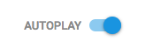
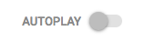

# TurnOffAutoPlay extension
**Objective:** turn off Youtube **autoplay** for ever[1](#f1). Even after you clear your
browsing data, it will still be turn off.

This **experimental** extension (not yet in the chrome web store) modifies the
**PREF** cookie (from **https://www.youtube.com**) to turn off the **autoplay**
feature.

**IMPORTANT:** only tested for the moment on the new youtube design. But the
old youtube design will be supported soon (see [TODOs](#todos))

## Installation notes
To install this **experimental** Chrome extension:
1. Go to `chrome://extensions/` on the Chrome browser
1. Check the **Developer mode** box at the top. This will trigger new buttons
to be available at the top of the page.
1. Click on the **Load unpacked extension...** button
1. Select the extension directory [TurnOffAutoPlay](TurnOffAutoPlay)
1. The **TurnOffAutoPlay** extension should now be installed

## How to use it
1. Go to your favorite **Youtube** video page
1. The **AUTOPLAY** button on the top right of the page should be disabled (grayed out)
1. Now can you see your favorite video without getting bothered at the end by a suggested video
1. Enjoy!

**BEFORE**

**AFTER**

## How to disable it
To disable the extension:
1. Go to `chrome://extensions/` on the Chrome browser
1. Look for the **TurnOffAutoPlay** extension and uncheck the **Enabled** box
on the right
1. The Extension icon should be now gray out

To re-enable it, check the **Enable** box.

**NOTE:** an **Enable/Disable** option will be added to the extension icon

## How to remove it
To remove the extension from Chrome:
1. Click on the extension icon on the Chrome toolbar
1. Choose the **Remove from Chrome...** from the context menu.
A popup should get displayed asking **Remove "TurnOffAutoPlay"?**
1. Choose **Remove** button

## Code organization
The **TurnOffAutoPlay** extension is in the folder [TurnOffAutoPlay](TurnOffAutoPlay)

The **TurnOffAutoPlay** extension consists in the following components:
- `event.js`: in charge of modifying the "PREF" cookie
  - events listened to:
    - `chrome.cookies.onChanged`
    - `chrome.management.onEnabled`
    - `chrome.runtime.onInstalled`
- `content.js`: injects HTML code into the current youtube page to disable the
`paper-toggle-button` button
- `manifest.json`: declares the following permissions
  - `cookies`: to get access to the `chrome.cookies` API for `event.js` to be
  able to modify the **PREF** cookie
  - `*://*.youtube.com/*`
  - `management`

**Calls:**
- `chrome.cookies.get`
- `chrome.cookies.onChanged`
- `chrome.cookies.set`
- `chrome.management.onEnabled`
- `chrome.runtime.onInstalled`

**Source files:**
- [manifest.json](TurnOffAutoPlay/manifest.json)
- [event.js](TurnOffAutoPlay/event.js)
- [content.js](TurnOffAutoPlay/content.js)
- [movie-lock-red-16.png](TurnOffAutoPlay/icons/movie-lock-red-16.png)
- [movie-lock-red-128.png](TurnOffAutoPlay/icons/movie-lock-red-128.png)
- [movie-lock-white-16.png](TurnOffAutoPlay/icons/movie-lock-white-16.png)
- [movie-lock-white-128.png](TurnOffAutoPlay/icons/movie-lock-white-128.png)

**NOTE:** Icon attributions
- Extension icons and Icons for the Browser-Action button
- Icons made by <a href="http://www.freepik.com" title="Freepik">Freepik</a> from <a href="https://www.flaticon.com/" title="Flaticon">www.flaticon.com</a> is licensed by <a href="http://creativecommons.org/licenses/by/3.0/" title="Creative Commons BY 3.0" target="_blank">CC 3.0 BY</a>

## TODOs
**FEATURES:**
- Add **Enable/Disable** option in a popup linked with the Browser-Action button
  - It will enable/disable the extension
  - Indicate to the user that for the effect to take place, the page must be
  refreshed (e.g. see Ublock Origin extension)
  - The popup should display when clicking once (Mac) on the Browser-Action button
- When we hover over the **AUTOPLAY** text or the disabled toggle, we should
display a tooltip informing us that if we want to enable the toggle again, we
should disable the extension by clicking on the Browser-Action button.

**TESTING:**
- Test with the **old youtube design** and solve issues
- Test it while in Incognito mode and solve issues

  
  
**Footnotes:**  

<b id="f1">1</b>: Well at least as long as you have the **TurnOffAutoPlay** installed. [↩](#a1)
